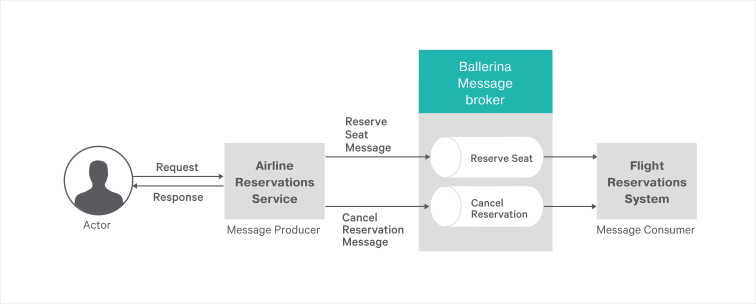

[](https://travis-ci.org/ballerina-guides/messaging-with-ballerina)

# Ballerina Message Broker  
[Ballerina Message Broker](https://github.com/ballerina-platform/ballerina-message-broker) is a light-weight, easy-to-use, 100% open source message broker that uses AMQP as the messaging protocol.

> Let’s take a look at a sample real world scenario to understand how to use Ballerina message broker for messaging.
 
The following topics walk you through the steps to build a RESTful Web service using Ballerina message broker:

- [What you'll build](#what-youll-build)
- [Prerequisites](#prerequisites)
- [Implementation](#implementation)
- [Testing](#testing)
- [Deployment](#deployment)
- [Observability](#observability)

## What you’ll build 

Consider an online airline reservation application that allows you to perform the following tasks:
- Reserving seats on a flight
- Cancelling a reservation

The following diagram illustrates the scenario of the airline reservation service with Ballerina messaging.  

&nbsp;
&nbsp;
&nbsp;
&nbsp;



&nbsp;
&nbsp;
&nbsp;
&nbsp;

For each task, you send a message on a particular Ballerina message queue. 

- To reserve a seat you send an HTTP POST message that contains the passenger details to the `http://localhost:9090/airline/reservation` URL. 
- To cancel an existing booking you send an HTTP POST request to the `http://localhost:9090/airline/cancellation` URL.

The appropriate message flow receives the message from the queue and processes the message.

## Prerequisites
 
- [Ballerina Distribution](https://ballerina.io/learn/getting-started/)
- A Text Editor or an IDE 

### Optional requirements
- Ballerina IDE plugins ([IntelliJ IDEA](https://plugins.jetbrains.com/plugin/9520-ballerina), [VSCode](https://marketplace.visualstudio.com/items?itemName=WSO2.Ballerina), [Atom](https://atom.io/packages/language-ballerina))
- [Docker](https://docs.docker.com/engine/installation/)
- [Kubernetes](https://kubernetes.io/docs/setup/)

## Implementation

> If you want to skip the basics and move directly to the [Testing](#testing) section, you can download the project from git and skip the instructions on [Implementation](#implementation) the service.

### Create the project structure

Ballerina is a complete programming language that allows you to have any custom project structure that you want. 
 
Use the following package structure for this project:

```
messaging-with-ballerina
 └── guide
    ├── airline_backend_system
    │   └── flight_booking_backend.bal
    └── flight_booking_service
        ├── airline_resrvation.bal
        └── tests
            └── airline_reservation_test.bal
```
- Create the above directories in your local machine and also create empty `.bal` files.

- Then open the terminal and navigate to `messaging-with-ballerina/guide` and run Ballerina project initializing toolkit.
```bash
   $ ballerina init
```

Now that you have created the project structure, the next step is to implement the airline reservation Web service.
  
### Develop the airline reservation Web service with the Ballerina message sender

You need to implement the airline reservation service as a RESTful service that accepts flight booking requests. The service should be able to receive a request from a user as a HTTP POST method, extract passenger details from the request, and then send the reservation details to the flight booking system using messaging.

Follow the guidelines given below to implement the airline reservation service:

- Use Ballerina message broker as the message broker in the process.

- Use `endpoint mb:SimpleQueueSender queueSenderBooking` as the endpoint of the message queue sender for new flight reservations. You can specify a required queue name inside the endpoint definition. The following sample uses the default configuration for the Ballerina message broker. 
- Use `endpoint mb:SimpleQueueSender queueSenderCancelling` as the endpoint to send requests to cancel a reservation.
- Use two separate queues to manage flight reservation and cancelation.

##### airline_resrvation.bal
```ballerina
import ballerina/mb;
import ballerina/log;
import ballerina/http;
import ballerina/io;

@Description {value:"Define the message queue endpoint for new reservations"}
endpoint mb:SimpleQueueSender queueSenderBooking {
    host:"localhost",
    port:5672,
    queueName:"NewBookingsQueue"
};

@Description {value:"Define the message queue endpoint to cancel reservations"}
endpoint mb:SimpleQueueSender queueSenderCancelling {
    host:"localhost",
    port:5672,
    queueName:"BookingCancellationQueue"
};

@Description {value:"Attributes associated with the service endpoint"}
endpoint http:Listener airlineReservationEP {
    port:9090
};

@Description {value:"Airline reservation service exposed via HTTP/1.1."}
@http:ServiceConfig {
    basePath:"/airline"
}
service<http:Service> airlineReservationService bind airlineReservationEP {
    @Description {value:"Resource for reserving seats on a flight"}
    @http:ResourceConfig {
        methods:["POST"],
        path:"/reservation"
    }
    bookFlight(endpoint conn, http:Request req) {
        http:Response res = new;
        // Get the reservation details from the request
        json requestMessage = check req.getJsonPayload();
        string booking = requestMessage.toString();

        // Create a message to send to the flight reservation system
        mb:Message message = check queueSenderBooking.createTextMessage(booking);
        // Send the message to the message queue
        var _ = queueSenderBooking -> send(message);

        // Set the string payload when reservation is successful.
        res.setStringPayload("Your booking was successful");

        // Send the response back to the client.
        _ = conn -> respond(res);
    }

    @Description {value:"Resource for canceling already reserved seats on a flight"}
    @http:ResourceConfig {
        methods:["POST"],
        path:"/cancellation"
    }
    cancelBooking(endpoint conn, http:Request req) {
        http:Response res = new;
        // Get the reservation details from the request
        json requestMessage = check req.getJsonPayload();
        string cancelBooking = requestMessage.toString();

        // Create a message to send to the flight reservation system
        mb:Message message = check queueSenderCancelling.createTextMessage(cancelBooking);
        // Send the message to the message queue
        var _ = queueSenderCancelling -> send(message);

        // Set the string payload when the reservation is successful.
        res.setStringPayload("Your booking was successful");

        // Send the response back to the client.
        _ = conn -> respond(res);
    }
}
```

### Implement the airline reservation backend system with Ballerina message receiver

You can receive messages from the flight reservation service through the Ballerina message broker.

- Define endpoints to receive messages from Ballerina message queues.

- Use `endpoint mb:SimpleQueueReceiver queueReceiverBooking` as the endpoint for new flight reservation
messages. You can specify parameters inside the endpoint to connect to the Ballerina message broker. The following sample uses the defaults values.

- Use `endpoint mb:SimpleQueueReceiver queueReceiverCancelling` as the endpoint for the message broker and queue to cancel flight reservations.

- Use a Ballerina message listener service for each message queue. You can declare the message listener service for a new reservation using the `service<mb:Consumer> bookingListener bind queueReceiverBooking ` service. Inside the service you can have the ` onMessage(endpoint consumer, mb:Message message)` resource that can trigger when a new message arrives at the defined queue. Inside the resource you can handle the business logic that you want to use when a new flight booking request is made. The following sample prints the message on the console.

- Similarly you can have the `service<mb:Consumer> cancellingListener bind queueReceiverCancelling` service to handle flight cancelation requests.

##### flight_booking_system.bal

```ballerina
import ballerina/mb;
import ballerina/log;

@description{value:"Queue receiver endpoint for new flight reservations"}
endpoint mb:SimpleQueueReceiver queueReceiverBooking {
    host:"localhost",
    port:5672,
    queueName:"NewBookingsQueue"
};

@description{value:"Queue receiver endpoint for cancelation of flight reservations"}
endpoint mb:SimpleQueueReceiver queueReceiverCancelling {
    host:"localhost",
    port:5672,
    queueName:"BookingCancellationQueue"
};

@description{value:"Service to receive messages to the new reservation message queue"}
service<mb:Consumer> bookingListener bind queueReceiverBooking {
    @description{value:"Resource handler for new messages from queue"}
    onMessage(endpoint consumer, mb:Message message) {
        // Get the new message as the string
        string messageText = check message.getTextMessageContent();
        // Mock the processing of the message for a new reservation.
        log:printInfo("[NEW BOOKING] Details : " + messageText);
    }
}

@description{value:"Service to receive messages to the cancelation message queue"}
service<mb:Consumer> cancellingListener bind queueReceiverCancelling {
    @description{value:"Resource handler for new messages from queue"}
    onMessage(endpoint consumer, mb:Message message) {
        // Get the new message as the string
        string messageText = check message.getTextMessageContent();
        // Mock the processing of the message to cancel a reservation
        log:printInfo("[CANCEL BOOKING] : " + messageText);
    }
}
```

Now you have completed developing the airline reservation service with Ballerina messaging. 


## Testing 

### Invoking the airline reservation service with ballerina message broker

- First, you need to run Ballerina message broker.You can start Ballerina message broker by entering the following command in your termainal.
```
$ broker 
```
NOTE: Ballerina message broker is included in the Ballerina distribution. You can find the executable file of the message broker at `<BALLERINA_DISTRIBUTION>/bin/broker`. Also the Ballerina message broker is avaiblable [here](https://github.com/ballerina-platform/ballerina-message-broker).

- Next, open a terminal, navigate to `messaging-with-ballerina/guide`, and execute the following command to run the airline reservation backend system (which listen to the message queues):
```
$ballerina run airline_backend_system
```

- Then, open a terminal, navigate to `messaging-with-ballerina/guide`, and execute the following command to run flight booking service(which serves client requests throughout HTTP REST calls):
```
$ballerina run flight_booking_service/
```

- Now you can execute the following curl commands to call the airline reservation service and reserve a seat in a flight:

**Book a seat** 

```
 curl -v -X POST -d '{ "Name":"Alice", "SSN":123456789, "Address":"345,abc,def", \
 "Telephone":112233 }' "http://localhost:9090/airline/reservation" -H \
 "Content-Type:application/json"

Output :  
Your booking was successful.
```

**Cancel Reservation** 
```
curl -v -X POST -d '{ "bookingID":"A32D"}' "http://localhost:9090/airline/cancellation"\
-H "Content-Type:application/json"

Output : 
You have successfully canceled your booking.
```
- `airline_backend_system` is the system that processes messages sent through the Ballerina message broker. You will see the following logs printed on your console when you run `guide.flight_booking_system`

```
2018-04-23 21:08:09,475 INFO  [airline_backend_system] - [NEW BOOKING] Details :\
{"Name":"Alice","SSN":123456789,"Address":"345,abc,def","Telephone":112233} 

2018-04-23 21:10:59,439 INFO  [airline_backend_system] - [CANCEL BOOKING] : \
{"bookingID":"AV323D"} 

```

### Writing unit tests 

In Ballerina, the unit test cases should be in the same package inside a folder named as 'tests'.  When writing the test functions the below convention should be followed.
- Test functions should be annotated with `@test:Config`. See the below example.
```ballerina
   @test:Config
   function testBookingService() {
```

To run the unit tests, open your terminal and navigate to `messaging-with-ballerina/guide`, and run the following command.
```bash
$ ballerina test flight_booking_service 
```
NOTE: You need to run Ballerina message broker before running the above test case

To check the implementation of the test file, refer to the `tests` directories in the [repository](https://github.com/ballerina-guides/messaging-with-ballerina).

## Deployment

After you develop the service, you can deploy it. 

### Deploy locally

- As the first step, you can build a Ballerina executable archive (.balx) of the services that we developed above. Navigate to `messaging-with-ballerina/guide` and run the following commands. 

```
$ballerina build flight_booking_service
```

```
$ballerina build airline_backend_system
```

- Once the `flight_booking_service.balx` and `flight_booking_system.balx` files are created inside the target folder, you can use the following commands to run the .balx files: 

```
$ballerina run target/flight_booking_service.balx
```

```
$ballerina run target/airline_backend_system.balx
```

- Successful execution of the service displays the following output. 
```
$ballerina run guide.ballerina_messaging/
ballerina: initiating service(s) in 'guide.ballerina_messaging'
ballerina: started HTTP/WS endpoint 0.0.0.0:9090
```

```
$ ballerina  run guide.flight_booking_system/
ballerina: initiating service(s) in 'guide.flight_booking_system'
2018-04-23 20:39:41,872 INFO  [ballerina.jms] - Message receiver created \
for queue NewBookingsQueue 
2018-04-23 20:39:41,905 INFO  [ballerina.jms] - Message receiver created \
for queue BookingCancellationQueue 

```

### Deploying on Docker

You can run the service that we developed above as a docker container. As Ballerina platform includes [Ballerina_Docker_Extension](https://github.com/ballerinax/docker), which offers native support for running ballerina programs on containers, you just need to put the corresponding docker annotations on your service code. 

- In our order_mgt_service, we need to import  `ballerinax/docker` and use the annotation `@docker:Config` as shown below to enable docker image generation during the build time. 

##### airline_reservation.bal
```ballerina
import ballerina/mb;
import ballerina/log;
import ballerina/http;
import ballerina/io;
import ballerinax/docker;

@docker:Config {
    registry:"ballerina.guides.io",
    name:"airliine_reservation",
    tag:"v1.0"
}

@Description { value: "Queue sender endpoint for new bookings" }
endpoint mb:SimpleQueueSender queueSenderBooking {
    host: "localhost",
    port: 5672,
    queueName: "NewBookingsQueue"
};

@Description { value: "Queue sender endpoint for cancel bookings" }
endpoint mb:SimpleQueueSender queueSenderCancelling {
    host: "localhost",
    port: 5672,
    queueName: "BookingCancellationQueue"
};

@docker:Expose{}
@Description { value: "Attributes associated with the service endpoint" }
endpoint http:Listener airlineReservationEP {
    port: 9090
};

@Description { value: "Airline reservation service exposed via HTTP/1.1." }
@http:ServiceConfig {
    basePath: "/airline"
}
service<http:Service> AirlineReservation bind airlineReservationEP {
``` 

- `@docker:Config` annotation is used to provide the basic docker image configurations for the sample. `@docker:Expose {}` is used to expose the port. 

- Now you can build a Ballerina executable archive (.balx) of the service that we developed above, using the following command. It points to the service file that we developed above and it will create an executable binary out of that. 
This will also create the corresponding docker image using the docker annotations that you have configured above. Navigate to `messaging-with-ballerina/guide` and run the following command.  
```
   $ ballerina build flight_booking_service

   Run following command to start docker container: 
   docker run -d -p 9090:9090 ballerina.guides.io/flight_booking_service:v1.0
```

- Once you successfully build the docker image, you can run it with the `docker run` command that is shown in the previous step.  
```   
   $ docker run -d -p 9090:9090 ballerina.guides.io/flight_booking_service:v1.0
```

  Here we run the docker image with flag `-p <host_port>:<container_port>` so that we  use  the host port 9090 and the container port 9090. Therefore you can access the service through the host port. 

- Verify docker container is running with the use of `$ docker ps`. The status of the docker container should be shown as 'Up'. 
- You can access the service using the same curl commands that we've used above. 
```
 curl -v -X POST -d '{ "Name":"Alice", "SSN":123456789, "Address":"345,abc,def", \
 "Telephone":112233 }' "http://localhost:9090/airline/reservation" -H \
 "Content-Type:application/json"
```

### Deploying on Kubernetes

- You can run the service that we developed above, on Kubernetes. The Ballerina language offers native support for running a ballerina programs on Kubernetes, with the use of Kubernetes annotations that you can include as part of your service code. Also, it will take care of the creation of the docker images. So you don't need to explicitly create docker images prior to deploying it on Kubernetes. Refer to [Ballerina_Kubernetes_Extension](https://github.com/ballerinax/kubernetes) for more details and samples on Kubernetes deployment with Ballerina. You can also find details on using Minikube to deploy Ballerina programs. 

- Let's now see how we can deploy our `flight_booking_service` on Kubernetes.

- First we need to import `ballerinax/kubernetes` and use `@kubernetes` annotations as shown below to enable kubernetes deployment for the service we developed above. 

##### airline_reservation.bal

```ballerina
import ballerina/mb;
import ballerina/log;
import ballerina/http;
import ballerina/io;
import ballerinax/kubernetes;

@kubernetes:Ingress {
    hostname:"ballerina.guides.io",
    name:"ballerina-guides-flight-booking-service",
    path:"/"
}

@kubernetes:Service {
    serviceType:"NodePort",
    name:"ballerina-guides-flight-booking-service"
}

@kubernetes:Deployment {
    image:"ballerina.guides.io/flight-booking-service:v1.0",
    name:"ballerina-guides-flight-booking-service"
}
@Description { value: "Queue sender endpoint for new bookings" }
endpoint mb:SimpleQueueSender queueSenderBooking {
    host: "localhost",
    port: 5672,
    queueName: "NewBookingsQueue"
};

@Description { value: "Queue sender endpoint for cancel bookings" }
endpoint mb:SimpleQueueSender queueSenderCancelling {
    host: "localhost",
    port: 5672,
    queueName: "BookingCancellationQueue"
};

@Description { value: "Attributes associated with the service endpoint" }
endpoint http:Listener airlineReservationEP {
    port: 9090
};

@Description { value: "Airline reservation service exposed via HTTP/1.1." }
@http:ServiceConfig {
    basePath: "/airline"
}
service<http:Service> AirlineReservation bind airlineReservationEP {
``` 

- Here we have used `@kubernetes:Deployment` to specify the docker image name which will be created as part of building this service. 
- We have also specified `@kubernetes:Service` so that it will create a Kubernetes service which will expose the Ballerina service that is running on a Pod.  
- In addition we have used `@kubernetes:Ingress` which is the external interface to access your service (with path `/` and host name `ballerina.guides.io`)

- Now you can build a Ballerina executable archive (.balx) of the service that we developed above, using the following command. It points to the service file that we developed above and it will create an executable binary out of that. 
This will also create the corresponding docker image and the Kubernetes artifacts using the Kubernetes annotations that you have configured above.
  
```
   $ ballerina build flight_booking_service
  
   Run following command to deploy kubernetes artifacts:  
   kubectl apply -f ./target/flight_booking_service/kubernetes
```

- You can verify that the docker image that we specified in `@kubernetes:Deployment` is created, by using `$ docker images`. 
- Also the Kubernetes artifacts related our service, will be generated in `./target/flight_booking_service/kubernetes`. 
- Now you can create the Kubernetes deployment using:

```
   $ kubectl apply -f ./target/flight_booking_service/kubernetes 
 
   deployment.extensions "ballerina-guides-flight-booking-service" created
   ingress.extensions "ballerina-guides-flight-booking-service" created
   service "ballerina-guides-flight-booking-service" created
```

- You can verify Kubernetes deployment, service and ingress are running properly, by using following Kubernetes commands.

```
   $ kubectl get service
   $ kubectl get deploy
   $ kubectl get pods
   $ kubectl get ingress
```

- If everything is successfully deployed, you can invoke the service either via Node port or ingress. 

Node Port:
 
```
 curl -v -X POST -d '{ "Name":"Alice", "SSN":123456789, "Address":"345,abc,def", \
 "Telephone":112233 }' "http://localhost:9090/airline/reservation" -H \
 "Content-Type:application/json"
```

Ingress:

Add `/etc/hosts` entry to match hostname. 
``` 
127.0.0.1 ballerina.guides.io
```

Access the service 
``` 
 curl -v -X POST -d '{ "Name":"Alice", "SSN":123456789, "Address":"345,abc,def", \
 "Telephone":112233 }' "http://localhost:9090/airline/reservation" -H \
 "Content-Type:application/json"
```

## Observability 
Ballerina is by default observable. Meaning you can easily observe your services, resources, etc.
However, observability is disabled by default via configuration. Observability can be enabled by adding following configurations to `ballerina.conf` file in `messaging-with-ballerina/guide/`.

```ballerina
[b7a.observability]

[b7a.observability.metrics]
# Flag to enable Metrics
enabled=true

[b7a.observability.tracing]
# Flag to enable Tracing
enabled=true
```

NOTE: The above configuration is the minimum configuration needed to enable tracing and metrics. With these configurations default values are load as the other configuration parameters of metrics and tracing.

### Tracing 

You can monitor ballerina services using in built tracing capabilities of Ballerina. We'll use [Jaeger](https://github.com/jaegertracing/jaeger) as the distributed tracing system.
Follow the following steps to use tracing with Ballerina.

- You can add the following configurations for tracing. Note that these configurations are optional if you already have the basic configuration in `ballerina.conf` as described above.
```
   [b7a.observability]

   [b7a.observability.tracing]
   enabled=true
   name="jaeger"

   [b7a.observability.tracing.jaeger]
   reporter.hostname="localhost"
   reporter.port=5775
   sampler.param=1.0
   sampler.type="const"
   reporter.flush.interval.ms=2000
   reporter.log.spans=true
   reporter.max.buffer.spans=1000
```

- Run Jaeger docker image using the following command
```bash
   $ docker run -d -p5775:5775/udp -p6831:6831/udp -p6832:6832/udp -p5778:5778 -p16686:16686 \
   -p14268:14268 jaegertracing/all-in-one:latest
```

- Navigate to `messaging-with-ballerina/guide` and run the restful-service using following command 
```
   $ ballerina run flight_booking_service/
```

- Observe the tracing using Jaeger UI using following URL
```
   http://localhost:16686
```

### Metrics
Metrics and alerts are built-in with ballerina. We will use Prometheus as the monitoring tool.
Follow the below steps to set up Prometheus and view metrics for Ballerina restful service.

- You can add the following configurations for metrics. Note that these configurations are optional if you already have the basic configuration in `ballerina.conf` as described under `Observability` section.

```ballerina
   [b7a.observability.metrics]
   enabled=true
   provider="micrometer"

   [b7a.observability.metrics.micrometer]
   registry.name="prometheus"

   [b7a.observability.metrics.prometheus]
   port=9700
   hostname="0.0.0.0"
   descriptions=false
   step="PT1M"
```

- Create a file `prometheus.yml` inside `/tmp/` location. Add the below configurations to the `prometheus.yml` file.
```
   global:
     scrape_interval:     15s
     evaluation_interval: 15s

   scrape_configs:
     - job_name: prometheus
       static_configs:
         - targets: ['172.17.0.1:9797']
```

   NOTE : Replace `172.17.0.1` if your local docker IP differs from `172.17.0.1`
   
- Run the Prometheus docker image using the following command
```
   $ docker run -p 19090:9090 -v /tmp/prometheus.yml:/etc/prometheus/prometheus.yml \
   prom/prometheus
```
   
- You can access Prometheus at the following URL
```
   http://localhost:19090/
```

NOTE:  Ballerina will by default have following metrics for HTTP server connector. You can enter following expression in Prometheus UI
-  http_requests_total
-  http_response_time


### Logging

Ballerina has a log package for logging to the console. You can import ballerina/log package and start logging. The following section will describe how to search, analyze, and visualize logs in real time using Elastic Stack.

- Start the Ballerina Service with the following command from `restful-service/guide`
```
   $ nohup ballerina run flight_booking_service &>> ballerina.log&
```
   NOTE: This will write the console log to the `ballerina.log` file in the `messaging-with-ballerina/guide` directory

- Start Elasticsearch using the following command

- Start Elasticsearch using the following command
```
   $ docker run -p 9200:9200 -p 9300:9300 -it -h elasticsearch --name \
   elasticsearch docker.elastic.co/elasticsearch/elasticsearch:6.2.2 
```

   NOTE: Linux users might need to run `sudo sysctl -w vm.max_map_count=262144` to increase `vm.max_map_count` 
   
- Start Kibana plugin for data visualization with Elasticsearch
```
   $ docker run -p 5601:5601 -h kibana --name kibana --link \
   elasticsearch:elasticsearch docker.elastic.co/kibana/kibana:6.2.2     
```

- Configure logstash to format the ballerina logs

i) Create a file named `logstash.conf` with the following content
```
input {  
 beats{ 
     port => 5044 
 }  
}

filter {  
 grok{  
     match => { 
	 "message" => "%{TIMESTAMP_ISO8601:date}%{SPACE}%{WORD:logLevel}%{SPACE}
	 \[%{GREEDYDATA:package}\]%{SPACE}\-%{SPACE}%{GREEDYDATA:logMessage}"
     }  
 }  
}   

output {  
 elasticsearch{  
     hosts => "elasticsearch:9200"  
     index => "store"  
     document_type => "store_logs"  
 }  
}  
```

ii) Save the above `logstash.conf` inside a directory named as `{SAMPLE_ROOT}\pipeline`
     
iii) Start the logstash container, replace the `{SAMPLE_ROOT}` with your directory name
     
```
$ docker run -h logstash --name logstash --link elasticsearch:elasticsearch \
-it --rm -v ~/{SAMPLE_ROOT}/pipeline:/usr/share/logstash/pipeline/ \
-p 5044:5044 docker.elastic.co/logstash/logstash:6.2.2
```
  
 - Configure filebeat to ship the ballerina logs
    
i) Create a file named `filebeat.yml` with the following content
```
filebeat.prospectors:
- type: log
  paths:
    - /usr/share/filebeat/ballerina.log
output.logstash:
  hosts: ["logstash:5044"]  
```
NOTE : Modify the ownership of filebeat.yml file using `$chmod go-w filebeat.yml` 

ii) Save the above `filebeat.yml` inside a directory named as `{SAMPLE_ROOT}\filebeat`   
        
iii) Start the logstash container, replace the `{SAMPLE_ROOT}` with your directory name
     
```
$ docker run -v {SAMPLE_ROOT}/filbeat/filebeat.yml:/usr/share/filebeat/filebeat.yml \
-v {SAMPLE_ROOT}/guide/flight_booking_service/ballerina.log:/usr/share\
/filebeat/ballerina.log --link logstash:logstash docker.elastic.co/beats/filebeat:6.2.2
```
 
 - Access Kibana to visualize the logs using following URL
```
   http://localhost:5601 
```
  
 
