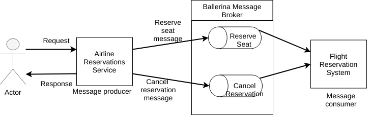

# Ballerina Message Broker  
[Ballerina Message Broker](https://github.com/ballerina-platform/ballerina-message-broker) is a light-weight, easy-to-use, 100% open source message broker that uses AMQP 0-9-1 as the messaging protocol.

Let’s take a look at a sample real world scenario to understand how to use Ballerina message broker for messaging.
 
The following topics walk you through the steps to build a RESTful Web service using Ballerina message broker:

- [Introducing the sample](#introducing-the-sample)
- [Prerequisites](#prerequisites)
- [Developing the service](#developing-the-service)
- [Testing](#testing)
- [Deployment](#deployment)
- [Observability](#observability)

## Introducing the sample

Consider an online airline reservation application that allows you to perform the following tasks:
- Reserving seats on a flight
- Cancelling a reservation

The following diagram illustrates the scenario of the airline reservation service with Ballerina messaging.  

&nbsp;
&nbsp;
&nbsp;
&nbsp;



&nbsp;
&nbsp;
&nbsp;
&nbsp;

For each task, you send a message on a particular Ballerina message queue. 

- To reserve a seat you send an HTTP POST message that contains the passenger details to the `http://localhost:9090/airline/reservation` URL. 
- To cancel an existing booking you send an HTTP POST request to the `http://localhost:9090/airline/cancellation` URL.

The appropriate message flow receives the message from the queue and processes the message.

## Prerequisites
 
- JDK 1.8 or later
- [Ballerina Distribution](https://github.com/ballerina-lang/ballerina/blob/master/docs/quick-tour.md)
- [Ballerina Message Broker](https://github.com/ballerina-platform/ballerina-message-broker)
- A text editor or an IDE 

### Optional requirements
- Ballerina IDE plugins ([IntelliJ IDEA](https://plugins.jetbrains.com/plugin/9520-ballerina), [VSCode](https://marketplace.visualstudio.com/items?itemName=WSO2.Ballerina), [Atom](https://atom.io/packages/language-ballerina))
- [Docker](https://docs.docker.com/engine/installation/)

## Developing the service 

> If you want to skip the basics and move directly to the [testing](#testing) section, you can download the project from git and skip the instructions on developing the service.

### Create the project structure

Ballerina is a complete programming language that allows you to have any custom project structure that you want. 
 
Use the following package structure for this project:

```
messaging-with-ballerina
├── Ballerina.toml
├── guide.flight_booking_service
│   └── airline_resrvation.bal
└── guide.flight_booking_system
    └── flight_booking_system.bal

```
You can use the Ballerina project initializing toolkit to create the Ballerina project structure given above.

- First, create a new directory named `restful-service` in your local machine, and then navigate to the directory using a new terminal. 
- Next, enter the following in the Ballerina project initializing toolkit:
```bash
restful-service$ ballerina init -i
Create Ballerina.toml [yes/y, no/n]: (y) y
Organization name: (username) messaging-with-ballerina
Version: (0.0.1) 
Ballerina source [service/s, main/m]: (s) s
Package for the service : (no package) guide.flight_booking_service
Ballerina source [service/s, main/m]: (s) s
Package for the service : (no package) guide.flight_booking_system
Ballerina source [service/s, main/m, finish/f]: (f) f

Ballerina project initialized
```

- Once you initialize the Ballerina project, you can change the names of the files to match the project file names specified in this guide.

Now that you have created the project structure, the next step is to implement the airline reservation Web service.
  
### Implement the airline reservation Web service with the Ballerina message sender

You need to implement the airline reservation service as a RESTful service that accepts flight booking requests. The service should be able to receive a request from a user as a HTTP POST method, extract passenger details from the request, and then send the reservation details to the flight booking system using messaging.

Follow the guidelines given below to implement the airline reservation service:

- Use Ballerina message broker as the message broker in the process.

- Use `endpoint mb:SimpleQueueSender queueSenderBooking` as the endpoint of the message queue sender for new flight reservations. You can specify a required queue name inside the endpoint definition. The following sample uses the default configuration for the Ballerina message broker. 
- Use `endpoint mb:SimpleQueueSender queueSenderCancelling` as the endpoint to send requests to cancel a reservation.
- Use two separate queues to manage flight reservation and cancelation.

##### airline_resrvation.bal
```ballerina
import ballerina/mb;
import ballerina/log;
import ballerina/http;
import ballerina/io;

@Description {value:"Define the message queue endpoint for new reservations"}
endpoint mb:SimpleQueueSender queueSenderBooking {
    host:"localhost",
    port:5672,
    queueName:"NewBookingsQueue"
};

@Description {value:"Define the message queue endpoint to cancel reservations"}
endpoint mb:SimpleQueueSender queueSenderCancelling {
    host:"localhost",
    port:5672,
    queueName:"BookingCancellationQueue"
};

@Description {value:"Attributes associated with the service endpoint"}
endpoint http:Listener airlineReservationEP {
    port:9090
};

@Description {value:"Airline reservation service exposed via HTTP/1.1."}
@http:ServiceConfig {
    basePath:"/airline"
}
service<http:Service> airlineReservationService bind airlineReservationEP {
    @Description {value:"Resource for reserving seats on a flight"}
    @http:ResourceConfig {
        methods:["POST"],
        path:"/reservation"
    }
    bookFlight(endpoint conn, http:Request req) {
        http:Response res = new;
        // Get the reservation details from the request
        json requestMessage = check req.getJsonPayload();
        string booking = requestMessage.toString();

        // Create a message to send to the flight reservation system
        mb:Message message = check queueSenderBooking.createTextMessage(booking);
        // Send the message to the message queue
        var _ = queueSenderBooking -> send(message);

        // Set the string payload when reservation is successful.
        res.setStringPayload("Your booking was successful");

        // Send the response back to the client.
        _ = conn -> respond(res);
    }

    @Description {value:"Resource for canceling already reserved seats on a flight"}
    @http:ResourceConfig {
        methods:["POST"],
        path:"/cancellation"
    }
    cancelBooking(endpoint conn, http:Request req) {
        http:Response res = new;
        // Get the reservation details from the request
        json requestMessage = check req.getJsonPayload();
        string cancelBooking = requestMessage.toString();

        // Create a message to send to the flight reservation system
        mb:Message message = check queueSenderCancelling.createTextMessage(cancelBooking);
        // Send the message to the message queue
        var _ = queueSenderCancelling -> send(message);

        // Set the string payload when the reservation is successful.
        res.setStringPayload("Your booking was successful");

        // Send the response back to the client.
        _ = conn -> respond(res);
    }
}
```

### Implement the airline reservation system with Ballerina message receiver

You can receive messages from the flight reservation service through the Ballerina message broker.

- Define endpoints to receive messages from Ballerina message queues.

- Use `endpoint mb:SimpleQueueReceiver queueReceiverBooking` as the endpoint for new flight reservation
messages. You can specify parameters inside the endpoint to connect to the Ballerina message broker. The following sample uses the defaults values.

- Use `endpoint mb:SimpleQueueReceiver queueReceiverCancelling` as the endpoint for the message broker and queue to cancel flight reservations.

- Use a Ballerina message listener service for each message queue. You can declare the message listener service for a new reservation using the `service<mb:Consumer> bookingListener bind queueReceiverBooking ` service. Inside the service you can have the ` onMessage(endpoint consumer, mb:Message message)` resource that can trigger when a new message arrives at the defined queue. Inside the resource you can handle the business logic that you want to use when a new flight booking request is made. The following sample prints the message on the console.

- Similarly you can have the `service<mb:Consumer> cancellingListener bind queueReceiverCancelling` service to handle flight cancelation requests.

##### flight_booking_system.bal

```ballerina
import ballerina/mb;
import ballerina/log;

@description{value:"Queue receiver endpoint for new flight reservations"}
endpoint mb:SimpleQueueReceiver queueReceiverBooking {
    host:"localhost",
    port:5672,
    queueName:"NewBookingsQueue"
};

@description{value:"Queue receiver endpoint for cancelation of flight reservations"}
endpoint mb:SimpleQueueReceiver queueReceiverCancelling {
    host:"localhost",
    port:5672,
    queueName:"BookingCancellationQueue"
};

@description{value:"Service to receive messages to the new reservation message queue"}
service<mb:Consumer> bookingListener bind queueReceiverBooking {
    @description{value:"Resource handler for new messages from queue"}
    onMessage(endpoint consumer, mb:Message message) {
        // Get the new message as the string
        string messageText = check message.getTextMessageContent();
        // Mock the processing of the message for a new reservation.
        log:printInfo("[NEW BOOKING] Details : " + messageText);
    }
}

@description{value:"Service to receive messages to the cancelation message queue"}
service<mb:Consumer> cancellingListener bind queueReceiverCancelling {
    @description{value:"Resource handler for new messages from queue"}
    onMessage(endpoint consumer, mb:Message message) {
        // Get the new message as the string
        string messageText = check message.getTextMessageContent();
        // Mock the processing of the message to cancel a reservation
        log:printInfo("[CANCEL BOOKING] : " + messageText);
    }
}
```

Now you have completed developing the airline reservation service with Ballerina messaging. 


## Testing 

### Invoking the airline reservation service with ballerina message broker

- First, you need to run [Ballerina message broker](https://github.com/ballerina-platform/ballerina-message-broker). Follow the instruction in the Ballerina message broker Github repository to set up the Ballerina message broker.
```
<BALLERINA_MESSAGE_BROKER>/bin$ ./broker.sh 
```

- Next, open a terminal, navigate to `<SAMPLE_ROOT_DIRECTORY>/`, and execute the following command to run the flight booking system (which listen to the message queues)`guide.flight_booking_system`:
```
$ballerina run guide.flight_booking_system/
```
NOTE: You need to have Ballerina installed in you local machine to run the Ballerina service.  

- Then, open a terminal, navigate to `<SAMPLE_ROOT_DIRECTORY>/`, and execute the following command to run flight booking service(which serves client requests throughout HTTP REST calls)`guide.flight_booking_service`:
```
$ballerina run guide.flight_booking_service/
```
- Now you can execute the following curl commands to call the airline reservation service and reserve a seat in a flight:

**Book a seat** 

```
 curl -v -X POST -d '{ "Name":"Alice", "SSN":123456789, "Address":"345,abc,def", \
 "Telephone":112233 }' "http://localhost:9090/airline/reservation" -H \
 "Content-Type:application/json"


Output :  
Your booking was successful.
```

**Cancel Reservation** 
```
curl -v -X POST -d '{ "bookingID":"A32D"}' "http://localhost:9090/airline/cancellation"\
-H "Content-Type:application/json"

Output : 
You have successfully canceled your booking.
```
- `guide.flight_booking_system` is the system that processes messages sent through the Ballerina message broker. You will see the following logs printed on your console when you run `guide.flight_booking_system`

```
2018-04-23 21:08:09,475 INFO  [guide.flight_booking_system] - [NEW BOOKING] Details :\
{"Name":"Alice","SSN":123456789,"Address":"345,abc,def","Telephone":112233} 

2018-04-23 21:10:59,439 INFO  [guide.flight_booking_system] - [CANCEL BOOKING] : \
{"bookingID":"AV323D"} 

```

### Writing unit tests 

In Ballerina, unit test cases should be in the same package within a folder named `test`. The naming convention should be as follows:

* Test functions should contain the `test` prefix.
  * e.g.: testResourceAddOrder()

Execute the following command to run the unit tests:
```bash
   $ballerina test
```

## Deployment

After you develop the service, you can deploy it. 

### Deploy locally

- Navigate to the `<SAMPLE_ROOT>/` directory and run the following commands to build the Ballerina executable archive (.balx) files of the service that you developed. This points to the directory in which the service was developed and creates an executable binary. 

```
$ballerina build guide.flight_booking_service
```

```
$ballerina build guide.flight_booking_system
```

- Once the `guide.flight_booking_service.balx` and `guide.flight_booking_system.balx` files are created inside the target folder, you can use the following commands to run the .balx files: 

```
$ballerina run target/guide.flight_booking_service.balx
```

```
$ballerina run target/guide.flight_booking_system.balx
```

- Successful execution of the service displays the following output. 
```
$ballerina run guide.ballerina_messaging/
ballerina: initiating service(s) in 'guide.ballerina_messaging'
ballerina: started HTTP/WS endpoint 0.0.0.0:9090
```

```
$ ballerina  run guide.flight_booking_system/
ballerina: initiating service(s) in 'guide.flight_booking_system'
2018-04-23 20:39:41,872 INFO  [ballerina.jms] - Message receiver created \
for queue NewBookingsQueue 
2018-04-23 20:39:41,905 INFO  [ballerina.jms] - Message receiver created \
for queue BookingCancellationQueue 

```
